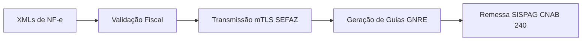

# Apex GNRE SaaS — Documentação da Solução

O **Apex GNRE SaaS** é a solução do Grupo Aliados Hub Tech desenvolvida para automatizar de ponta a ponta o ciclo de vida de guias GNRE para e-commerces, distribuidoras e indústrias com operações interestaduais.

---

## 🎯 Objetivo da Solução

Eliminar o preenchimento manual de guias estaduais e a digitação individual de pagamentos bancários, transformando lotes de notas fiscais eletrônicas (XML da NF-e) em guias validadas e arquivos de remessa bancária prontos para pagamento.

---

## 🔄 Fluxo Operacional

1. **Importação em Lote**:
   - Upload de múltiplos arquivos XML de NF-e através da interface ou API.
2. **Validação das Operações**:
   - Verificação automática de regras de partilha (DIFAL, FCP, ST) e identificação do estado de destino.
3. **Transmissão mTLS com Certificado A1**:
   - Comunicação autenticada diretamente com os webservices da SEFAZ utilizando o certificado digital A1 da empresa emitente.
4. **Geração das Guias (PDF e Código de Barras)**:
   - Emissão das guias oficiais com código de barras, linha digitável e consolidação em PDF único ou arquivo ZIP.
5. **Remessa Bancária Itaú SISPAG (CNAB 240)**:
   - Geração do arquivo de remessa bancária para liquidação em lote pelo banco, evitando pagamento manual guia a guia.

---

## 📋 Requisitos para Operação do Cliente

- **Certificado Digital A1**: arquivo `.pfx` ou `.p12` válido da empresa emitente.
- **Conta Bancária Homologada**: convênio SISPAG Itaú habilitado para pagamento de tributos em lote (CNAB 240).
- **Ambiente de Emissão**: acesso aos webservices estaduais correspondentes às UFs de destino.

---

## 💼 Modelos de Contratação

| Plano | Volume de Guias | Certificados A1 | Suporte |
| :--- | :--- | :--- | :--- |
| **Starter** | Até 100 guias/mês | 1 Certificado | E-mail |
| **Pro** | Até 500 guias/mês | Múltiplos | Prioritário WhatsApp |
| **Advanced** | Até 1.500 guias/mês | Múltiplos + Filas dedicadas | 24/7 + Gerente de conta |

> **Nota de Segurança:** Esta documentação contém apenas especificações funcionais e arquiteturais públicas. Chaves criptográficas, certificados e credenciais de bancos de dados pertencem exclusivamente aos ambientes de execução isolados do SaaS.
