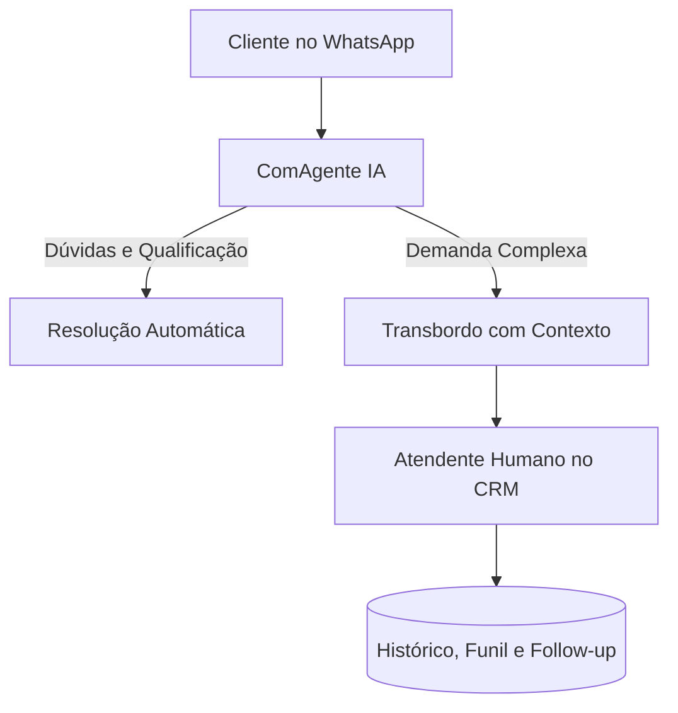

# ComAgente — Documentação da Solução

O **ComAgente** é a plataforma de atendimento inteligente multicanal (WhatsApp) do Grupo Aliados Hub Tech, integrando inteligência artificial generativa, atendimento humano (handoff), CRM visual e distribuição inteligente de chamados.

---

## 🎯 Objetivo da Solução

Centralizar e organizar o canal de atendimento no WhatsApp, permitindo que a inteligência artificial resolva dúvidas frequentes, qualifique leads e consulte status de pedidos, transferindo a conversa contextualmente para a equipe humana quando necessário.

---

## 🔄 Arquitetura Funcional

1. **Atendimento 24/7 com IA**:
   - Respostas instantâneas baseadas na base de conhecimento e regras de negócio da empresa.
2. **Handoff Inteligente**:
   - Transbordo para atendentes humanos com histórico consolidado e motivo do direcionamento.
3. **Distribuição Automática**:
   - Roteamento por departamento, fila de espera e disponibilidade dos operadores.
4. **CRM Integrado e Funil de Vendas**:
   - Gestão de oportunidades, etiquetas (tags), etapas de contato e lembretes de follow-up.
5. **Dashboard Operacional**:
   - Métricas em tempo real de tempo médio de atendimento (TMA), tempo de primeira resposta (FRT), volume por atendente e taxa de conversão.

---

## 💼 Modelos de Contratação

| Plano | Instâncias WhatsApp | Atendentes | Recursos |
| :--- | :--- | :--- | :--- |
| **Starter** | 1 instância | Até 2 | Dashboard básico e IA |
| **Professional** | 3 instâncias | Até 10 | CRM completo e relatórios avançados |
| **Business** | 10 instâncias | Até 30 | Acesso a API e personalizações |
| **Enterprise** | Personalizado | Ilimitados | Infraestrutura dedicada e CSM exclusivo |

> **Nota de Segurança:** Esta documentação contém apenas especificações funcionais e arquiteturais públicas. Tokens de API do WhatsApp, segredos de webhook e credenciais de banco de dados pertencem aos repositórios e variáveis de ambiente isoladas do SaaS.
